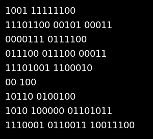

<a name="readme-top"></a>

[![Contributors][contributors-shield]][contributors-url]
[![Forks][forks-shield]][forks-url]
[![Stargazers][stars-shield]][stars-url]
[![Issues][issues-shield]][issues-url]
[![MIT License][license-shield]][license-url]


<!-- PROJECT LOGO -->
<br />
<div align="center">
  <a href="https://github.com/0xStabby/bin-image-machine">
    
  </a>

<h3 align="center">bin-image-machine</h3>

  <p align="center">
    Scripts used to generate BitByteBin bins metadata and base64 images
    <br />
    <a href="https://github.com/0xStabby/bin-image-machine"><strong>Explore the docs »</strong></a>
    <br />
    <br />
    <a href="https://github.com/0xStabby/bin-image-machine">View Demo</a>
    ·
    <a href="https://github.com/0xStabby/bin-image-machine/issues">Report Bug</a>
    ·
    <a href="https://github.com/0xStabby/bin-image-machine/issues">Request Feature</a>
  </p>
</div>


<!-- TABLE OF CONTENTS -->
<details>
  <summary>Table of Contents</summary>
  <ol>
    <li>
      <a href="#about-the-project">About The Project</a>
      <ul>
        <li><a href="#built-with">Built With</a></li>
      </ul>
    </li>
    <li>
      <a href="#getting-started">Getting Started</a>
      <ul>
        <li><a href="#prerequisites">Prerequisites</a></li>
        <li><a href="#installation">Installation</a></li>
      </ul>
    </li>
    <li><a href="#usage">Usage</a></li>
    <li><a href="#license">License</a></li>
    <li><a href="#contact">Contact</a></li>
  </ol>
</details>


<!-- ABOUT THE PROJECT -->
## About The Project

[![Product Name Screen Shot][product-screenshot]](https://github.com/BitByteBin/bin-image-machine)

The purpose of the Bin project is to be as generic as possible so to not stifle creativity in building things around it.

By using binary bits which only have 2 options, users and devs of the community will have to decide how to get the values you want from it to use as they wish.

Each bit can be either 0 or 1, nothing more nothing less, 50/50 chance either way.

There are however some rules around these numbers, which does bring rarity into play.

### Rules:
#### Bits/Byte:
* 1%-1 Bits/Byte
* 3%-2 Bits/Byte
* 6%-3 Bits/Byte
* 9%-4 Bits/Byte
* 4%-5 Bits/Byte
* 20%-6 Bits/Byte
* 57%-7 Bits/Byte
#### Bytes/Line:
* 1%-1 Bytes/Line
* 39%-2 Bytes/Line
* 60%-3 Bytes/Line
#### Lines:
* 0.1%-7 Lines
* 0.9%-8 Lines
* 99%-9 Lines

<p align="right">(<a href="#readme-top">back to top</a>)</p>


### Built With

* [![Node.js][Node.js]][Node.js-url]
* [![Probability.js][Probability.js]][Probability.js-url]

<p align="right">(<a href="#readme-top">back to top</a>)</p>


<!-- GETTING STARTED -->
## Getting Started

This is an example of how you may give instructions on setting up your project locally.
To get a local copy up and running follow these simple example steps.

### Prerequisites

This is an example of how to list things you need to use the software and how to install them.
* node & npm
  ```sh
  apt install nodejs npm
  ```


### Installation

1. Clone the repo
   ```sh
   git clone https://github.com/0xStabby/bin-image-machine.git
   ```
2. Install NPM packages
   ```sh
   npm install
   ```

<p align="right">(<a href="#readme-top">back to top</a>)</p>


<!-- USAGE EXAMPLES -->
## Usage
To generate the Bins:
* Generate Collection
```sh
node index.js
```
[![Product Name Screen Shot][product-screenshot]](https://github.com/BitByteBin/bin-image-machine)

To generate a Binary image used for logos and BitByteBin brand styling:
* Generate logo
```sh
node logo.js
```
[![Logo][logo]](https://github.com/BitByteBin/bin-image-machine)

<p align="right">(<a href="#readme-top">back to top</a>)</p>


<!-- LICENSE -->
## License

Distributed under the MIT License. See `LICENSE.txt` for more information.

<p align="right">(<a href="#readme-top">back to top</a>)</p>


<!-- CONTACT -->
## Contact

0xStabby Twitter: [@0xStabby](https://twitter.com/0xStabby)

BitByteBin Twitter: [@BitByteBin](https://twitter.com/BitByteBin)

Project Link: [https://github.com/0xStabby/bin-image-machine](https://github.com/0xStabby/bin-image-machine)

<p align="right">(<a href="#readme-top">back to top</a>)</p>


<!-- MARKDOWN LINKS & IMAGES -->
[contributors-shield]: https://img.shields.io/github/contributors/0xStabby/bin-image-machine.svg?style=for-the-badge
[contributors-url]: https://github.com/0xStabby/bin-image-machine/graphs/contributors
[forks-shield]: https://img.shields.io/github/forks/0xStabby/bin-image-machine.svg?style=for-the-badge
[forks-url]: https://github.com/0xStabby/bin-image-machine/network/members
[stars-shield]: https://img.shields.io/github/stars/0xStabby/bin-image-machine.svg?style=for-the-badge
[stars-url]: https://github.com/0xStabby/bin-image-machine/stargazers
[issues-shield]: https://img.shields.io/github/issues/0xStabby/bin-image-machine.svg?style=for-the-badge
[issues-url]: https://github.com/0xStabby/bin-image-machine/issues
[license-shield]: https://img.shields.io/github/license/0xStabby/bin-image-machine.svg?style=for-the-badge
[license-url]: https://github.com/0xStabby/bin-image-machine/blob/master/LICENSE.txt
[product-screenshot]: assets/0.png
[logo]: logo/1024.png
[Node.js]: https://img.shields.io/static/v1?style=for-the-badge&message=Node.js&color=339933&logo=Node.js&logoColor=FFFFFF&label=
[Node.js-url]: https://nodejs.org
[Probability.js]: https://img.shields.io/badge/Probability.js-magenta?style=for-the-badge
[Probability.js-url]: https://github.com/fschaefer/Probability.js
